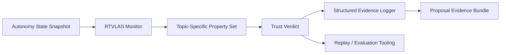

# Architecture

This repository adapts RTVLAS for **HR0011SB20254XL-01 ALIAS Missionized Autonomy for Emergency Services**.

## System Role

**Opening angle:** ALIAS/MATRIX mission-app assurance for emergency autonomy

## Runtime Elements

- `core/`: monitor, property framework, evidence writer
- `bindings/`: C ABI for external autonomy stacks
- `tooling/replay/`: deterministic replay of autonomy traces
- `tooling/eval/`: scenario evaluator and artifact generation
- `evidence/`: pre-generated scenario outputs for reviewers

## Topic Adaptation

The property set in this repository is tuned for:

- Fireline Standoff Margin
- Terrain and Smoke Clearance Margin
- Divert / Dip Site Reachability
- Mission App Recovery Readiness
- Air-Ground Coordination Link
