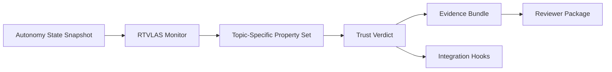

# Technical Volume

## 1. Technical Thesis

The proposal opens with the following angle: **ALIAS/MATRIX mission-app assurance for emergency autonomy**.

RTVLAS is not proposed here as the primary autonomy engine. It is proposed as the supervisory runtime layer that determines when autonomy outputs should no longer be trusted. That positioning is well matched to the current submission posture because it focuses on interface definition, safety property construction, and low-order scenario evidence rather than expensive airworthiness-scale integration.

## 2. Solicitation-Specific Fit

**Track posture:** Direct-to-Phase-II

**Objective fit:** Deliver a third-party autonomy application that integrates with ALIAS/MATRIX for emergency-service missions such as wildfire reconnaissance, suppression support, cargo sling load, or medevac-style operations.

This repository is explicitly shaped around the following solicitation needs:

- missionized autonomy application behavior rather than core flight-control replacement
- integration with ALIAS/MATRIX concepts and AFSIM-style evaluation flows
- wildfire or emergency-response mission tasks with optional HMI and multi-aircraft coordination
- evidence that the mission app can remain safe and recoverable during degraded conditions

**Deliberate scope boundary:** This repository is shaped as a mission-app assurance and review module that sits above autonomy middleware; it is not a replacement for low-level flight controls.

## 3. Problem

Emergency-service autonomy mission apps need a lightweight assurance layer that can detect unsafe, stale, or unrecoverable wildfire-response behavior before it harms crews, payloads, or response timelines.

## 4. Proposed Solution

RTVLAS adapted as a wildfire and emergency-response mission-app assurance layer for ALIAS/MATRIX-style autonomy, monitoring whether missionized autonomous behaviors remain safe, timely, and recoverable during fireline reconnaissance and response operations.

The prototype consists of:

- a Rust runtime monitor that ingests autonomy state snapshots
- a property framework that evaluates topic-specific trust rules
- a structured evidence logger that writes JSON scorecards and human-readable proof logs
- replay and evaluation tooling for deterministic verification
- a C ABI that supports integration with existing autonomy stacks written in C or C++

## 5. Architecture

## 6. Topic-Specific Safety / Trust Properties

- **Fireline Standoff Margin**: Ensures the mission app maintains minimum distance from dynamic fireline hazards, structures, and exclusion zones.
- **Terrain and Smoke Clearance Margin**: Checks whether the mission autonomy retains enough altitude margin to clear terrain, smoke corridors, and recovery approaches.
- **Divert / Dip Site Reachability**: Ensures a safe divert point, dip site, or recovery zone remains within an acceptable reachability radius while the mission app is active.
- **Mission App Recovery Readiness**: Detects whether the mission stack remains in a recovery-capable state when emergency transitions are needed.
- **Air-Ground Coordination Link**: Tracks whether operator or incident-command supervision remains available for critical missionized autonomy review and override steps.

## 7. Preliminary Feasibility Evidence

This repository includes three deterministic scenarios that exercise both nominal and non-nominal behavior:

- **Nominal Fireline Recon Leg**: Emergency autonomy executes a stable wildfire reconnaissance leg with healthy standoff, clearance margin, and recovery readiness.
- **Smoke Corridor Compression**: Fireline hazard margins and air-ground coordination begin to degrade but remain within recoverable limits.
- **Unrecoverable Fireline Divert**: Divert reachability, hazard margin, and mission-app recovery readiness collapse simultaneously, forcing a reject-grade mission assurance event.

For each scenario, the package generates:

- `trust_scorecard.json`
- `timeline.json`
- `proof_log.txt`
- `trace.svg`

These artifacts provide preliminary data supporting the claim that the monitor can detect degraded or unsafe autonomy behavior while preserving a replayable evidence trail.

## 8. Differentiators

- low-compute runtime implementation in Rust
- clear C ABI for autonomy-stack integration
- property-based monitoring rather than opaque post hoc anomaly scoring
- deterministic replay and evidence regeneration
- direct claim-to-artifact traceability for reviewers

## 9. Execution Posture

The immediate objective is to mature this repository from a topic-tuned software prototype into a reviewer-verifiable package that defines architecture, interfaces, monitoring rules, evidence products, and a concrete path to next-phase integration.

## 10. End State

A software mission-assurance layer for ALIAS-style emergency autonomy programs that can supervise task execution, safety envelopes, and recovery readiness during degraded wildfire or public-safety operations.

## 11. Transition Path

Tie the assurance layer to ALIAS/MATRIX-compatible mission autonomy middleware, add operator review workflows, and demonstrate recovery-state transitions in realistic wildfire reconnaissance or emergency response scenarios.
